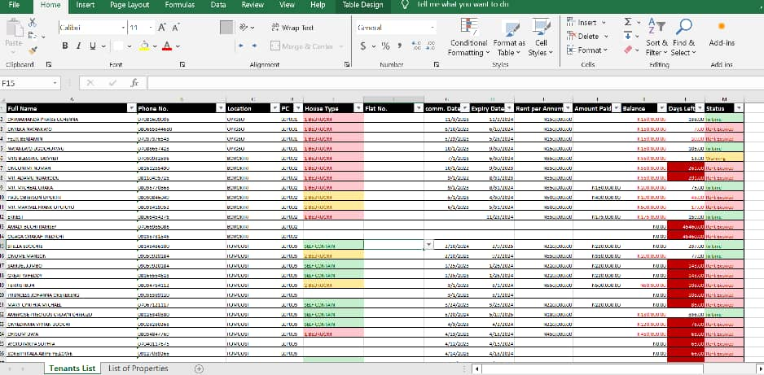
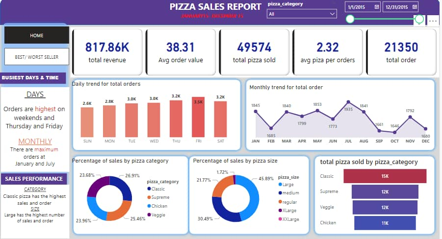
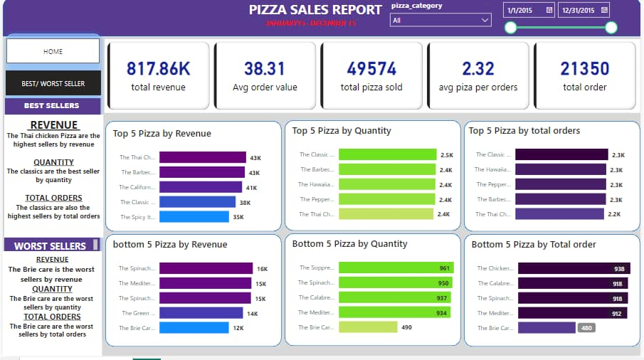
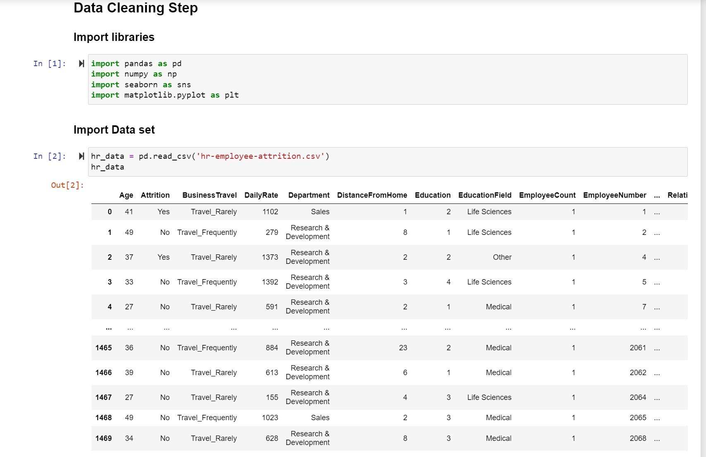

<!--Section 1: Introduce your self-->
## ABOUT ME

Hello! I'm Ebimoghan Kelvin 🤓, a data analyst and  data educator with a passion for turning data into actionable insights.

<!--Mention your top/relevant skills here - core and soft skills-->
## WHAT I DO

*I teach datat analysis at Bytemark where we train services for businesses and mentor aspiring analysts.*

**- ✅ Data Analytics, Data Manupulation, Data Transformation, Data Visualization.**

I provide in-depth analysis and tailored solutions to help you make data-driven decisions, optimize processes, and drive business growth. 

**- ✅ Staff Training & Development.**

I offer comprehensive training programs in data analysis, visualization, and data-driven decision-making. From beginner to advanced levels. 

<!--Section 2: List 3-4 key projects-->
## MY PORTFOLIO 

*A glimpse of some of the projects I've been working on.*

**Data entry form for a Property Management Company.**

I created a data entry for a Property management company in Portharcourt Locus Classicus. I used ms excel to create an automated form to help them track their tenants rent status per time.

[Read More](https://www.linkedin.com/posts/kelvin-ebimoghan-a2b0a9275_recently-did-this-automated-data-entry-form-activity-7216430498863017986-vL6G?utm_source=share&utm_medium=member_desktop&rcm=ACoAAEMcfIMBMqiRglRXfk1s8EqWDEDMyjq8_1U)

**PIZZA SALES REPORT**

So part of my journey was that i went online and found a dataset where i analyze the data using both SQL to querry the data and Powerbi to vizualize the data. 

[Read More](https://www.linkedin.com/posts/kelvin-ebimoghan-a2b0a9275_dataanalytics-datascience-activity-7102165150463369217-R4_-?utm_source=share&utm_medium=member_desktop&rcm=ACoAAEMcfIMBMqiRglRXfk1s8EqWDEDMyjq8_1U)

**Data cleaning and Data Visualization with Python.**

For this after i saw the exciting tool called python i decided to use it to do some analysis and visualization  

[Read More](https://www.linkedin.com/posts/kelvin-ebimoghan-a2b0a9275_another-day-as-a-data-analyst-on-this-project-activity-7113657887071121408-fH0a?utm_source=share&utm_medium=member_desktop&rcm=ACoAAEMcfIMBMqiRglRXfk1s8EqWDEDMyjq8_1U)

## CONTACT DETAILS

*Let’s connect and see how we can make a difference together!*
<table>
  <tbody>
    <tr>
      <td>📧</td>
      <td><a href="kelvinebimoghan05@gmail.com">kelvinebimoghan05@gmail.com</a></td>
    </tr>
    <tr>
      <td>📞</td>
      <td>(234) 814-784-2953</td>
    </tr>
    <tr>
      <td>📍</td>
      <td>PH, Nigeria</td>
    </tr>
    <tr>
      <td>⬇️</td>
      <td><a href="KELVIN EBIMOGHAN.pdf">Download my CV</a></td>
    </tr>
    <tr>
      <td>🌐</td>
      <td><a href="https://linkedin.com/in/kelvin-ebimoghan-a2b0a9275">The things I do daily on LinkedIn</a></td>
    </tr>
  </tbody>
</table>
